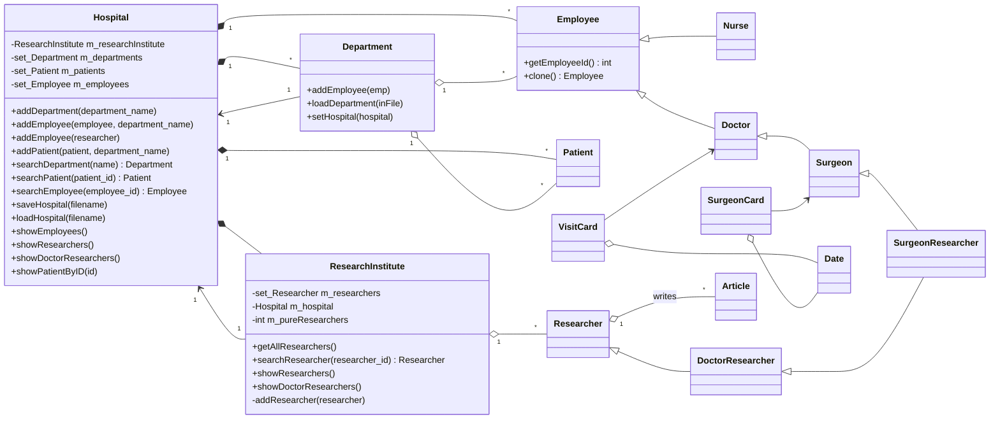

# Hospital Records System

A C++ project for managing hospital-related records, including doctors, researchers, and institutional data.

## Overview

This project provides a simple system for storing and managing hospital information. It demonstrates object-oriented design, data management, and structured record handling in C++.

The system is designed to model relationships between hospital entities such as medical staff and research personnel.

## Features

* Management of hospital records
* Doctor and researcher data handling
* Object-oriented design
* Structured data representation

## Purpose

This project was created for learning and demonstrating software design principles, data modeling, and C++ development practices.

## Class diagram

